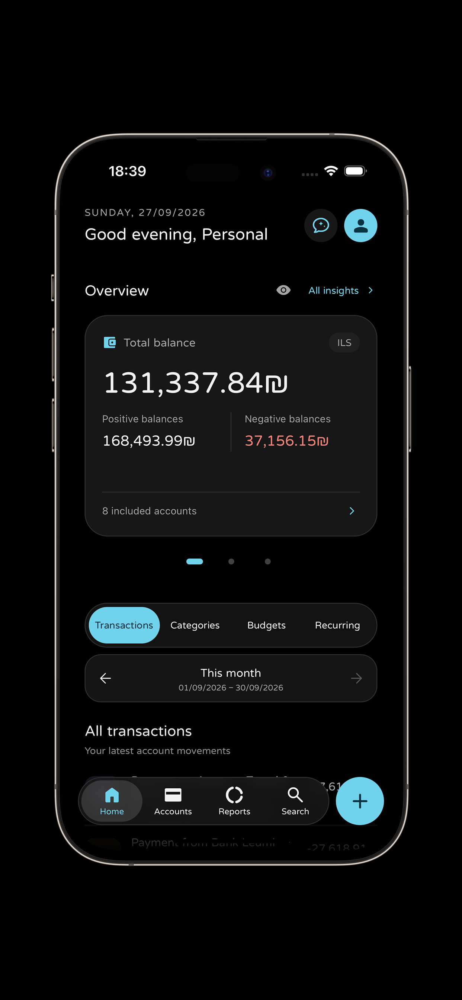
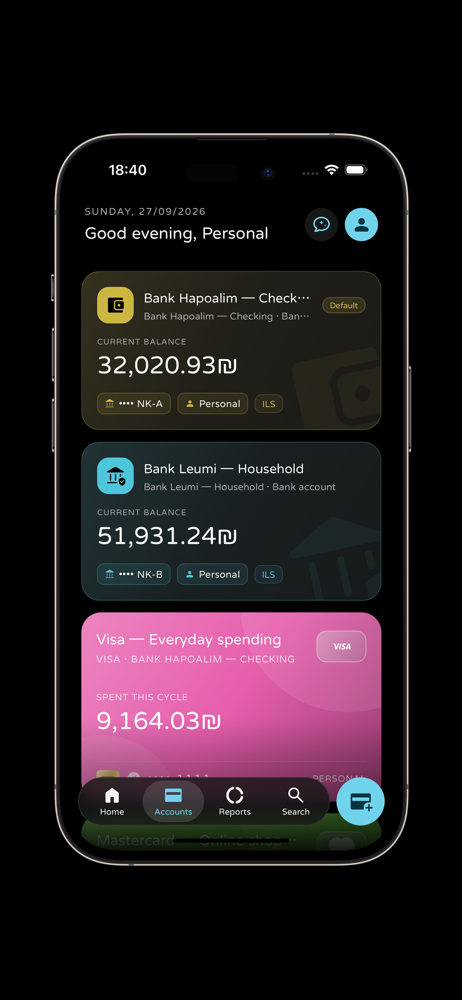
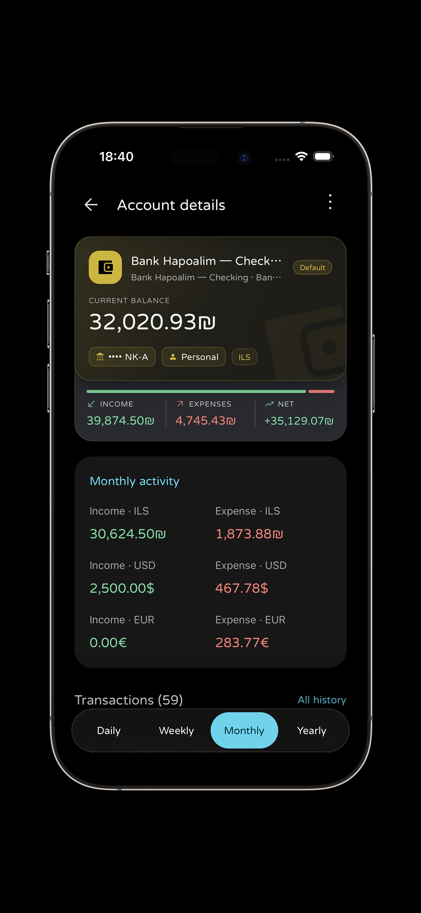
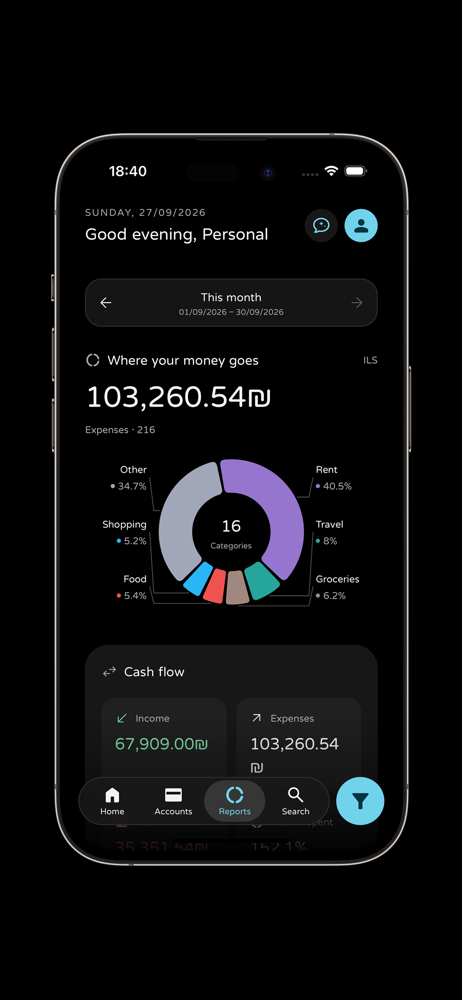
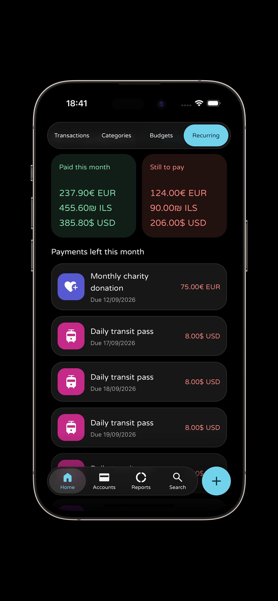
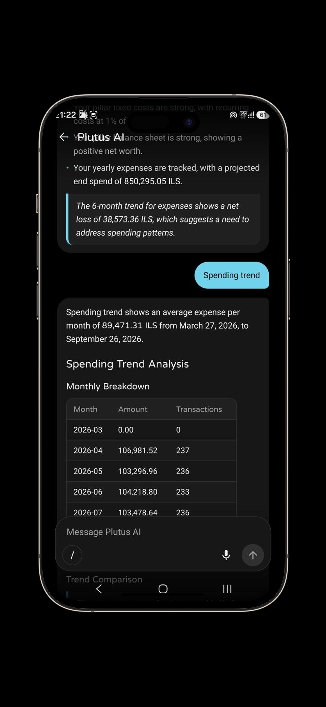
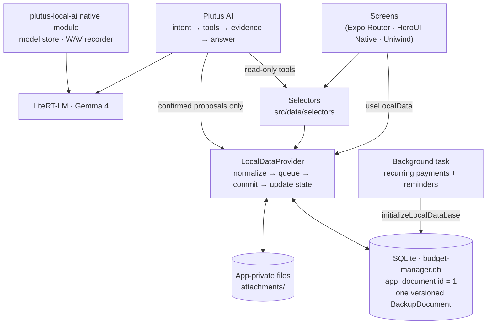

<div align="center">


# Plutus

**A private, local-first personal finance app for iOS and Android, with an on-device AI assistant.**

No accounts. No servers. No telemetry. Your financial records stay on your phone.

[](https://docs.expo.dev/versions/v57.0.0/)
[](https://reactnative.dev)
[](tsconfig.json)
[](#getting-started)
[](LICENSE)

</div>

<table>
  <tr>
    <td width="50%" valign="top">
      <table>
        <tr>
          <td width="84" valign="middle">
            
          </td>
          <td valign="middle">
            <sub>CREATOR</sub><br />
            <b>Alexander Aluf</b><br />
            ✉️ <a href="mailto:alexacdem@gmail.com">alexacdem@gmail.com</a><br />
            🌐 <a href="https://alexanderaluf.com">alexanderaluf.com</a>
          </td>
        </tr>
      </table>
    </td>
    <td width="50%" valign="top">
      <table>
        <tr>
          <td width="84" valign="middle">
            
          </td>
          <td valign="middle">
            <sub>IN COLLABORATION WITH</sub><br />
            <b>Project Aurora LTD</b><br />
            ✉️ <a href="mailto:projectaurora@orrora.com">projectaurora@orrora.com</a><br />
            🌐 <a href="https://beznest.com">beznest.com</a>
          </td>
        </tr>
      </table>
    </td>
  </tr>
</table>

---

## Table of contents

- [Why Plutus](#why-plutus)
- [Application showcase](#application-showcase)
- [Features](#features)
- [Privacy model](#privacy-model)
- [Architecture at a glance](#architecture-at-a-glance)
- [Tech stack](#tech-stack)
- [Getting started](#getting-started)
- [Scripts](#scripts)
- [Project structure](#project-structure)
- [Documentation](#documentation)
- [Contributing](#contributing)
- [License](#license)

---

## Why Plutus

Most budgeting apps ask you to create an account and sync your bank history to
someone else's server. Plutus takes the opposite approach:

- **Everything is stored on the device.** The complete dataset is a single
  versioned JSON document in an on-device SQLite database.
- **You own the backups.** Export ZIP, JSON or CSV files and keep them wherever
  you like. Plutus can also import backups from the Paisa app (version 3 format).
- **The AI runs on your phone.** Plutus AI uses Google's Gemma 4 model through
  LiteRT-LM. After a one-time model download, it works offline. Prompts,
  answers and voice recordings are not sent anywhere.

---

## Application showcase

<table>
  <tr>
    <td align="center" width="33%">
      <br />
      <b>🏠 Home overview</b><br />
      <sub>A greeting by time of day, total balance across included accounts, positive and negative balances, and a swipeable overview carousel. The glass selector switches between Transactions, Categories, Budgets and Recurring for the chosen financial month.</sub>
    </td>
    <td align="center" width="33%">
      <br />
      <b>💳 Accounts and cards</b><br />
      <sub>Bank, cash, savings and credit-card accounts, each with its own color, icon, currency and owner. Credit cards show issuer logos, last four digits and the amount spent in the current billing cycle.</sub>
    </td>
    <td align="center" width="33%">
      <br />
      <b>📊 Account details</b><br />
      <sub>Current balance with income, expenses and net flow, monthly activity broken down by original currency, and the account's transaction history grouped daily, weekly, monthly or yearly.</sub>
    </td>
  </tr>
  <tr>
    <td align="center" width="33%">
      <br />
      <b>🍩 Reports</b><br />
      <sub>"Where your money goes": a category donut chart with collision-free labels, cash flow, daily activity and money location. Every figure uses the conversion rate saved with each transaction.</sub>
    </td>
    <td align="center" width="33%">
      <br />
      <b>🔁 Recurring payments</b><br />
      <sub>Totals paid this month and still to pay, grouped by currency, plus a list of upcoming subscriptions and bills. Payments can be recorded automatically, processed or skipped by hand, and trigger optional local reminders.</sub>
    </td>
    <td align="center" width="33%">
      <br />
      <b>🤖 Plutus AI</b><br />
      <sub>An on-device financial assistant that answers from your real records. It can produce trend tables, health checks and forecasts, accepts voice input and slash commands, and never saves a change without your confirmation.</sub>
    </td>
  </tr>
</table>

---

## Features

### 💰 Money management

| Area | What you can do |
| :-- | :-- |
| **Transactions** | Expenses, income and transfers with categories, labels, places, people, loans, budgets, templates and receipt images. Transactions in foreign currencies store the exchange rate that was used. |
| **Accounts** | Bank, cash, savings and credit-card accounts. Credit cards link to a bank account and are settled automatically on their payment day. Savings accounts support product details, contributions, fees, estimated tax and withdrawal estimates. |
| **Categories** | Hierarchical categories for income and expenses, with 18 built-in base categories and custom icons and colors. Parent categories include the totals of their subcategories. |
| **Budgets** | Daily, weekly, monthly, yearly or custom periods, with account and category filters, subcategory inclusion, rollover and manual or automatic tracking. |
| **Recurring** | Daily to yearly schedules that don't drift across month ends or daylight-saving changes. Includes a calendar, catch-up for missed payments, background processing and local reminders. |
| **Reports** | Category breakdown, cash flow, daily activity and money location for any financial month. |
| **Search** | Full-text search in English, Hebrew and Russian, with quick filters and a filter sheet. |
| **Profiles** | Several profiles on one device (for example Personal, Freelance, Travel), each with its own main currency and fully separated data. |

### 🤖 Plutus AI (on-device)

- Runs **Gemma 4 E2B** (~2.6 GB) or **Gemma 4 E4B** (~3.7 GB) locally through
  [LiteRT-LM](https://github.com/google-ai-edge/LiteRT-LM). The model is
  downloaded after installation and checked against its SHA-256 hash.
- **66 read-only tools** across 10 packs: core, transactions, accounts, budgets,
  recurring, savings, wealth, metadata, currency and scenario. Plutus code
  calculates every number; the model only explains results it receives.
- **Safe changes:** the model can only *propose* a change. You review and
  edit the proposal, then confirm it, and the app's own domain logic saves it.
- **Voice input:** records 16 kHz mono WAV and transcribes it with Gemma on the
  device. On iOS, Apple's on-device speech recognizer is used if Gemma audio fails.
- Understands questions in English, Hebrew and Russian.

### 🌍 Personalization

- Languages: **English**, **Hebrew** (full right-to-left layout) and **Russian**.
- Light, dark and system themes with 8 accent colors.
- Configurable date format, financial-month start day (for example your payday) and week start day.
- A privacy toggle that hides every amount on screen.

### 💾 Backup and restore

| Format | Contents | Restore behavior |
| :-- | :-- | :-- |
| **ZIP** | `backup.json` plus every attachment | Full replacement, including media, after confirmation |
| **JSON** | All records, without images or attachments | Full replacement after confirmation |
| **CSV** | Transactions only (spreadsheet friendly) | Merges transactions by UUID |
| **Paisa v3 JSON** | Imported as-is; unknown fields are preserved | Full replacement after confirmation |

---

## Privacy model

Plutus has **no backend**: no accounts, analytics, crash reporting or cloud sync.
The app connects to the internet in only two cases:

| Request | What is sent | Why |
| :-- | :-- | :-- |
| Exchange rates ([currency-api](https://github.com/fawazahmed0/exchange-api)) | A public currency code, such as `usd` | Convert foreign-currency transactions. The rate is then stored with the transaction. |
| AI model download (Hugging Face) | A file request for a pinned model revision | One-time download of the Gemma model into app-private storage |

No balance, transaction, prompt, voice recording or AI answer ever leaves the
device. Optional Google Drive backup may be added later as an extra destination.
It is not implemented yet.

---

## Architecture at a glance



**Key design rules**

1. **One source of truth.** The whole dataset is a single `BackupDocument` JSON
   row in SQLite (WAL mode). Every change is written to SQLite first and only
   then shown in React state.
2. **Upgrades never lose data.** Before each schema migration, Plutus saves a
   checkpoint of the SQLite database. The migration runs in one exclusive
   transaction. If the stored data can't be read, the app opens a recovery
   screen; it never resets to an empty install.
3. **Unknown data is kept.** Imported backups may contain fields and collections
   Plutus doesn't use. They are preserved through every change and export.
4. **The AI can't write on its own.** The model may *request* a change, Plutus
   code *decides* what it would do, the user *approves* it, and trusted domain
   code *executes* it.

---

## Tech stack

| Layer | Technology |
| :-- | :-- |
| Framework | [Expo SDK 57](https://docs.expo.dev/versions/v57.0.0/), React Native 0.86 (New Architecture), React 19.2 with React Compiler |
| Navigation | Expo Router with typed routes |
| UI | [HeroUI Native](https://heroui.com), [Uniwind](https://uniwind.dev) (Tailwind CSS v4), Expo UI (SwiftUI bottom sheets on iOS), Reanimated 4, Gesture Handler, Expo Blur and Glass Effect |
| Storage | `expo-sqlite` (WAL), `expo-file-system` |
| Background | `expo-background-task`, `expo-task-manager`, `expo-notifications` (local notifications only) |
| Backup | `fflate` (ZIP), `papaparse` (CSV), `expo-document-picker`, `expo-sharing` |
| On-device AI | `react-native-litert-lm` 0.7.0 (LiteRT-LM 0.15.0), Nitro Modules, a custom Expo module in `modules/plutus-local-ai` (Kotlin and Swift) |
| i18n | `i18next`, `react-i18next`, `expo-localization` |
| Language | TypeScript 6 (strict) |
| Tests | Node's built-in test runner (`node:test`, `node:sqlite`) |

---

## Getting started

> Plutus uses custom native code (the on-device AI module and LiteRT-LM), so
> **it doesn't run in Expo Go**. Use a development build or a release build.

### Prerequisites

- **Node.js 22.13 or newer** (Node 24 LTS recommended). The tests use `node:sqlite`.
- **Android:** Android Studio, Android SDK and NDK, JDK 17. Minimum SDK is 26.
- **iOS (macOS only):** Xcode 26 or newer and CocoaPods.
- For Plutus AI: a **physical arm64 device** with at least 4 GB of RAM and about
  6–8.5 GB of free storage. Simulators and emulators aren't supported for the AI.

### Install and run

```bash
git clone https://github.com/alexanderaluf/budget-tracker.git
cd budget-tracker
npm install            # the postinstall step applies required native patches

npx expo run:android   # or: npx expo run:ios
```

After the first native build, start the development server with:

```bash
npx expo start --dev-client
```

### Build a release APK (Android)

```bash
npx expo prebuild --platform android --no-install
cd android
./gradlew assembleRelease -PreactNativeArchitectures=arm64-v8a
adb install -r app/build/outputs/apk/release/app-release.apk
```

For the full build, test and release guide (including iOS, validation and
store-release checks), see **[CONTRIBUTING.md](CONTRIBUTING.md)**.

---

## Scripts

| Command | Description |
| :-- | :-- |
| `npm start` | Start the Metro development server |
| `npm run android` | Build and run on an Android device or emulator |
| `npm run ios` | Build and run on an iOS device or simulator |
| `npm run lint` | Run ESLint with the Expo configuration |
| `npm test` | Run the whole Node test suite (`tests/*.test.cjs`) |
| `npx tsc --noEmit` | Type-check the project |
| `npx expo-doctor` | Check the Expo project for problems |

---

## Project structure

```text
budget-tracker/
├── src/
│   ├── app/                 # Expo Router routes (thin files that render feature screens)
│   ├── data/                # Local-first data layer
│   │   ├── model/           #   BackupDocument schema, normalizers, domain record logic
│   │   ├── database/        #   SQLite migrations, safe startup, atomic repository
│   │   ├── selectors/       #   Read-only view models derived from the document
│   │   ├── backup/          #   ZIP / JSON / CSV export and import
│   │   ├── attachments/     #   App-private file storage with staged restore
│   │   ├── recurring/       #   Recurring engine, background task, reminders
│   │   └── exchange-rates/  #   Public exchange-rate client
│   ├── features/            # One folder per product area (home, accounts, local-ai…)
│   ├── localization/        # i18next setup and en / he / ru dictionaries
│   └── shared/              # Navigation, theme, icons, reusable UI primitives
├── modules/plutus-local-ai/ # Custom Expo native module (Kotlin + Swift)
├── plugins/                 # Expo config plugins for the native AI build
├── scripts/                 # postinstall patches and test-data generators
├── tests/                   # Node test suite (*.test.cjs) and fixtures
├── test-data/               # Large fictional backups for testing on devices (en / he / ru)
├── docs/                    # Architecture and UI implementation guides
└── assets/                  # App icons, splash images, screenshots, card logos
```

---

## Documentation

| Document | Topic |
| :-- | :-- |
| [CONTRIBUTING.md](CONTRIBUTING.md) | Developer onboarding: setup, architecture, building, testing and pull requests |
| [AGENTS.md](AGENTS.md) | Required data-layer rules for humans and AI coding agents |
| [docs/storage-upgrades.md](docs/storage-upgrades.md) | First launch, migrations, checkpoints and recovery |
| [docs/application-data-map.md](docs/application-data-map.md) | Full reference for every entity and field |
| [docs/local-ai-architecture.md](docs/local-ai-architecture.md) | Plutus AI pipeline, tools, proposals and voice |
| [docs/recurring-transactions.md](docs/recurring-transactions.md) | Scheduling, conversion and background processing |
| [docs/reports-data-map.md](docs/reports-data-map.md) | How reports calculate their figures |
| [docs/device-test-backup-guide.md](docs/device-test-backup-guide.md) | Test datasets and the device test checklist |
| [docs/native-ios-bottom-sheets-guide.md](docs/native-ios-bottom-sheets-guide.md) | Native SwiftUI bottom sheets on iOS |
| [docs/bottom-glass-selector-guide.md](docs/bottom-glass-selector-guide.md) | Glass segmented selector and floating action button |
| [docs/bottom-action-gradient-guide.md](docs/bottom-action-gradient-guide.md) | Bottom action button and safe-area gradient |
| [docs/sticky-top-selector-header-guide.md](docs/sticky-top-selector-header-guide.md) | Sticky selector and fading header |

---

## Contributing

Contributions for noncommercial purposes are welcome. Before you open a pull
request, please read **[CONTRIBUTING.md](CONTRIBUTING.md)**. It covers the
data-safety rules that every change must follow and the validation steps to run.

---

## License

Copyright 2026 Alexander Aluf. This project is source-available under the
[PolyForm Noncommercial License 1.0.0](LICENSE).

You may view, fork, use, modify and redistribute this code for permitted
noncommercial purposes. Every copy, fork and redistribution must include the
license and the attribution notices in [NOTICE](NOTICE), which identify
Alexander Aluf as the original creator and copyright owner.

Commercial use requires prior written permission from Alexander Aluf. To ask
for a commercial license, email
[alexacdem@gmail.com](mailto:alexacdem@gmail.com) or get in touch through
[GitHub](https://github.com/alexanderaluf).

This is a source-available license, not an OSI-approved open-source license.
Third-party dependencies are covered by their own licenses. Material Symbols
Rounded icons are provided by Google under the Apache License 2.0.

<div align="center">
<br />
<br />
<sub>Made by <a href="https://alexanderaluf.com">Alexander Aluf</a> in collaboration with <a href="https://beznest.com">Project Aurora LTD</a>.</sub>
</div>
